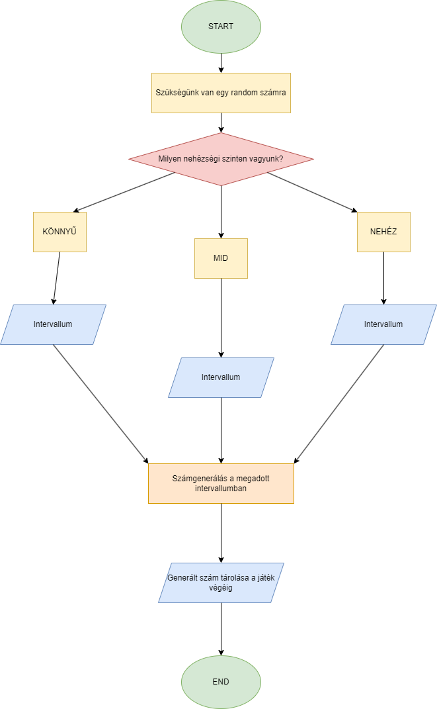

# Rendszerterv
## Rendszer:
Egyszerű számtippelésre alkalmas asztali felületű alkalmazás, amely bárki számára elérhető. Fő szempont, hogy csak szükséges mennyiségű kóddal, átlátható felhasználói felülettel egy gyorsan és rugalmasan működő fejlesztő játékot készítsünk. 

## Rendszer célja:
Egyszerű időtöltésre alkalmas, intuíció fejlesztő asztali alkalmazás, amely bárki számára elérhető. Célunk lenne a platformfüggetlenség, kevés erőforrással futtatható program, hogy nemtől és kortól függetlenül, de eszköz naprakészségétől függetlenül is bárki számára elérhető legyen a játék.

## Terv:
### Játékmenet folyamata

A játékmenet folyamata viszonylag egyszerű, annak ellenére is, hogy a folyamatábra alapján komplexnek tűnik.

### Kiindulás
User - A személy, aki aktuálisan játszani szeretne. Helyzettől függ a kiléte, lehet a tesztelő is, a megrendelő, vagy deployment után egy felhasználó. A rendszerterv ezen részében mint helytartó szó fog szerepelni.

A User elindítja az alkalmazást, betölt a GUI. Megadja a felhasználónevét az arra szolgáló rublikában.
Három gomb közül kiválaszthatja a neki megfelelő nehézségi szintet.
Lenyomja a start gombot, ez pedig meghív egy metódust, amely képes feldolgozni a megadott felhasználónevet és megnézi, adott-e meg a felhasználó nehézségi szintet. Ha túl hosszú és/vagy speciális karaktereket tartalmaz, új felhasználónevet kér. Ha nincs probléma a beírt felhasználónévvel, eltárolja azt. Ha üresen maradt a nehézségi szint, felszólítja a Usert, hogy válasszon szintet.

### A játék maga
A játék indulása után egy újabb metódus indul, amely megállapítja mely nehézségi szintet választotta a felhasználó. A nehézségi szint alapján egy változóba eltárolja a megfelelő adatbázis elérési útját, hogy a játék végén könnyebb legyen a ranglistát előállítani. Ezután meghív egy függvényt, amely a megfelelő intervallumon belül generál egy számot, amely tárolásra kerül egészen a játék végéig.

#### Számgenerálás folyamata

A következő GUI felületen tud tippet beírni a felhasználó. Egy metódus ellenőrizni fogja, hogy valóban számot adott meg a felhasználó, ezután pedig megnézi, hogy az eltárolt kitalálandó számhoz képest mennyivel nagyobb/kisebb. Kicsit kisebb/kisebb illetve kicsit nagyobb/nagyobb kommentekkel próbálja irányítani a felhasználót, hogy közeledjen a megoldáshoz. Ha a User a kitalálandó számhoz képest +-10-zel tippel, kicsit kisebb/nagyobb üzenetet kap. 

### A játék vége
Ha a User sikeresen beírta az arra szolgáló rublikába a kitalálandó számot, a játék véget ér. A lépései számát, illetve az elején eltárolt felhasználónevet egy adatbázishoz hozzáfűzi, majd belőle meghívja a top 10-es listát, lépések száma alapján.

### Új játék
Ha a User új játékot szeretne kezdeni, az arra szolgáló Új Játék gomb segítségével visszatérhet a kezdőlapra, ahol megadhat új felhasználónevet, választhat új nehézségi szintet.

### Ranglétra
Amikor a User befejezi a jelenlegi kört, a program kiírja neki hány lépésből találta ki a számot. Név megadása után a program elmenti egy fájlba a User nevét és azt hogy hányszor tippelt. Ezeket sorban minden játék végén beolvassa a program és megjeleníti hogy ki hogy teljesített.

### Ranglétra szerkesztése
Ha a User szeretne törölni a ranglistából arra lehetősége lesz. Viszont manuálisan hozzáadni vagy létező listaelem átnevezésére nem lesz lehetőség.

### Fájlba írás
A játék végén a program megnyit egy fájlt amibe kiírja a nevet és tippek számát. Ebből később beolvassa ezeket a ranglétra megjelenítéséhez.

### Feladás
A Usernek lehetősége van feladni a játékot. Ekkor a záróképernyőse lép, ahol megtudja, mely számot kellett volna eltárolnia. Feladás esetén a felhasználónév és a lépések száma nem kerül eltárolásra az adatbázisban.

### Egy életbeli példa, mely szemlélteti a játékmenetet
A User elindítja az alkalmazást, ugyanis felkeltette érdeklődését, van tizenöt perce, amit szeretne elütni valamivel, de nem vonzza a céltalan böngészés a közösségi médián.
A program kér egy felhasználónevet, gondolkodik, mit írjon be. Szórakozott kedvében van, és addig pötyögi felváltva az a és e betűket, amíg meg nem unja. Tizenöt perces szünetébe egy nehéz szint is belefér, meg egyébként is szereti a kihívásokat, így a nehézségi szintek közül a legnehezebbre nyom.
A start gomb megnyomása után várja, hogy átváltson a képernyő, de hopp! Hibaüzentetet kap, túl hosszú felhasználónevet írt be, kénytelen kiválasztani egy újat. Csak azután tud továbblépni, hogy 30 karakternél rövidebb nevet választott. 
A start gomb végre engedte, hogy továbblépjen, és pár pillanaton belül fel is szólítja az üzenet, hogy tippeljen 100 - 100 000 között. Vad tippje 600, és a program válaszol: Túl kicsit tippelt. Következő tippje az 1200, mánmeg túl nagyot tippelt. Meglövi a 800-at, valahol középen, a program válasza pedig az, hogy kicsit kisebb a tippje, mint a kitalálandó szám. User sejti, hogy nagyon közel lehet, így egyesével tippelget, míg be nem írja a 804-et. Ekkor a játék véget ér és megdicséri: Eltalálta a számot!
Büszke magára, ugyanis megjelenik a ranglista, rajta a felhasználónevével és a lépések számával. Örömködik, hogy ilyen hamar eltalálta, ugyanis belefér az idejébe még egy kör, így lenyomja az Új játék gombot.

### Felhasználói hozzáférhetőség

A fejlesztés során fontos szempont, hogy valóban mindenki számára használható legyen a játék. Ennek érdekében különös figyelmet fordítunk a felhasználói felület megjelenítésére. Első sorban a könnyenkezelhetőség a feladatunk, szeretnénk, hogy a felhasználó elé csak olyan tartalom kerüljön, ami számára releváns. Félrevezető gombok és ábrák nélkül fogjuk kivitelezni a megvalósítást, így megmarad egyszerű időtöltésnek, nem túlterhelő és/vagy figyelmet elterelő

Fizikai/érzékszervi korlátokkal rendelkező felhasználóink számára is akadálymentesítjük a felületet. Szemkímélő színpalettával dolgozunk, és terv szerint lehetőséget fogunk biztosítani a sötét/világos témák közötti váltásra. A villódzásmentesség egy olyan fontos tényező, melyet gyakran nem vesznek kellően számításba az interneten. Mi szeretnénk erre is hangsúlyt fektetni, így hanyagoljuk az olyaféle animációkat, melyek meghibásodás esetén villódzó képet okoznának.

Ezáltal az általunk létrehozott játék ezen szempontokból nem hátráltat senkit, nem limitálja részvételüket.

## Időpont:
A Miniprojekt elkészülési határideje az oktató által megszabott határidő. 

Maga a program, hozzáféréstől függően bármilyen időpontban futtatható és játszható.

## Erőforrások:
Olyan framework és programozási nyelvet alkalmazva szeretnénk létrehozni a játékot, amely kevés extra erőforrást igényel, hogy bármilyen asztali eszközön futtatható legyen. Erre JavaScript és Bootstrap a legalkalmasabb, így a fejlesztők számára is rugalmas és gyors a munka, mégis szép és megfelelő programot tudunk prezentálni.

# Tesztterv
## 1. Működőképesség tesztelése
Elsősorban a megírt funkciók helyes működéséről győződünk meg. Ehhez a fejlesztők különböző erőforrású számítógépeken futtatják a programot, és jegyzetet készítenek az esetleges előforduló hibákról. Ha minden számítógépen gond nélkül fut, továbbhaladhatunk a fejlesztéssel. Amennyiben egy is hibát dob, a helyzetet kielemezzük, megkeressük a befolyásoló tényezőt és kijavítjuk azt, majd csak ezután haladunk tovább.

A tesztet legalább 2 különböző számítógépen végezzük el, de minél több esetet szeretnénk ellenőrizni. Akkor nevezhető a teszt sikeresnek, ha a tesztelésre használt eszközök legalább fele 2 évnél idősebb. Erre azért van szükség, mert komolyan vesszük a felhasználó-orientáltságot, és nem realisztikus az a feltevés, hogy terhelésnek alig kitett, új gépeken fogják használni a programunkat. Célunk az esélyegyenlőség, azaz, hogy bárki szabadon használni tudja a játékot.

Ennek érdekében több féle eszközön fogjuk a tesztelést futtatni. Az elsődleges eszközök:
| Processzor | RAM  | Életkor | Állapot  |
|------------|------|---------|----------|
| AMD Ryzen 7   | 16GB | 2 év    | Kiváló    |
| AMD Ryzen 5  | 8GB  | 3 év    | Elégséges  |

Egyéb tesztelésre használt eszközök:
| Processzor | RAM  | Életkor | Állapot  |
|------------|------|---------|----------|
| AMD Ryzen 5   | 8GB | 1 év    | Kiváló    |
|  Intel Core i5  | 8GB  | 6 év    | Kielégítő  |
|  AMD Ryzen 5  | 31GB  | <1 év    | Kiváló  |

## 2. Felület tesztelése
Itt a fő szempont, hogy a felületen minden szükséges elem megtalálható, mindhez hozzá van kötve a megfelelő funkció. A kód tisztítása is itt történik, a funkcióval nem rendelkező elemek eltávolításra kerülnek.
A követelménylistánk a következő:

| Modul       | ID  | Név               | V   | Kifejtés                                       |
|-------------|-----|-------------------|-----|------------------------------------------------|
| Jogosultság | L1  | Névadás           | 1.0 | A felhasználó nevének megadása                |
| Modifikáció | M1  | Nehézség választás| 1.0 | A játék nehézségének kiválasztása             |
| Modifikáció | M2  | Név-rangsorba     | 1.0 | Név leadása a ranglistára                     |
| Feladat     | F1  | Start             | 1.0 | Start gomb ami átad a játékfelületre          |
| Feladat     | F2  | Tipp              | 1.0 | Mező ahova a tippet írjuk                     |
| Feladat     | F3  | Check             | 1.0 | Gomb ami a tippet leellenőrzi és kiírja hogy kisebb vagy nagyobb, vagy eltaláltuk és átrak a rangsor kijelzőre |
| Feladat     | F4  | Feladás           | 1.0 | Feladás gomb amivel feladhatjuk              |
| Jogosultság | L2  | Rangsor           | 1.0 | Rangsor kijelző                               |
| Jogosultság | L3  | Új játék          | 1.0 | Új játék indítása                              |

Az ehhez szükséges elemek:
| Név               | V   | Szükséges elem                                       |
|-------------------|-----|------------------------------------------------|
| Névadás           | 1.0 | Mező, amely billentyűzetről vár tartalmat                |
| Nehézség választás| 1.0 | 3 db gomb            |
| Név-rangsorba     | 1.0 | ranglistát kezelő függvények                     |
| Start             | 1.0 | Gomb          |
| Tipp              | 1.0 | Mező, amely billentyűzetről vár tartalmat                     |
| Check             | 1.0 | Gomb |
| Feladás           | 1.0 | Gomb              |
| Rangsor           | 1.0 | Kijelző, és ehhez tartozó adatbázis                               |
| Új játék          | 1.0 | Gomb                              | 

Egyéb elemek:
| Név               | V   | Szükséges elem                                       |
|-------------------|-----|------------------------------------------------|
| Témaváltó           | 1.0 | gomb                |

## 3. Felület kinézetének tesztelése
Célunk, hogy fizikai/érzékszervi korlátokkal rendelkező felhasználóink számára is akadálymentesítsük a felületet. Ennek érdekében külön figyelmet fordítunk a felület kinézetének ellenőrzésére. A színek kontrasztossága, a feliratok olvashatósága a szempont, így különböző monitorokon szeretnénk látni a futó kódot. Ezen tesztelési résznél ellenőrizzük, hogy van-e olyan dizájn-elem, amely nem rendelkezik saját funkcióval, de a felhasználó irányítására szolgál, és valamiféle hibát eredményezhet. Például egy felirat helytelen animálása vezethet villódzáshoz.
- Gombok helyes megjelenítése
- Feliratok olvashatósága
- Színek kontrasztosságának ellenőrzése
- Felületek közötti váltások rugalmassága
- Felületek tartalmának letisztultsága
- Felhasználó irányítására szolgáló, szerepüket tökéletesen ellátó üzenetek/feliratok

Külön felület kinézeti tesztet kap a sötét és a világos téma, így igény szerint lehet köztük váltani, fizikai/érzékszervi korlátok nem befolyásolják, melyiket használja a felhasználó.
- Gombok helyes megjelenítése
- Feliratok olvashatósága
- Színek kontrasztosságának ellenőrzése
- Felületek közötti váltások rugalmassága
- Felületek tartalmának letisztultsága
- Felhasználó irányítására szolgáló, szerepüket tökéletesen ellátó üzenetek/feliratok

## 4. Teljesítményteszt
Gyorsan működő program az elvárásunk, ezért fontos, hogy ellenőrizzük a sebességet. A tesztelés során A működőképesség tesztelésénél sorolt eszközökön megmérjük, mennyi időt vesz igénybe az első futás.

## 5. Biztonsági teszt
Egy nagyszabású program esetében fontos, hogy alapos biztonsági teszteken essen át. Ellenőrizendő, hogy a felhasználók adatai megfelelően védettek-e. Esetünkben a felhasználó nem tud olyan adatot megadni, amely önmagában elég lenne ahhoz, hogy bárminem visszaélés áldozata legyen. Ebből kifolyólag nem érdemes nagy figyelmet fordítanunk a biztonsági tesztre. Nem kerül érzékeny adat a rendszerbe, a felhasználó aggodalom nélkül élvezheti a játékot.

## 6. Kompatibilitási teszt
A programot több böngészőben is tesztelni fogjuk, mindegyik eszközön.
| Processzor | RAM  | Életkor | Állapot  | Chrome | Firefox | Edge   |
|------------|------|---------|----------|--------|---------|--------|
| AMD Ryzen 5   | 8GB | 1 év    | Kiváló    | x  |  x  |    |
|  Intel Core i5  | 8GB  | 6 év    | Kielégítő  | x  |    |  x  |
|  AMD Ryzen 5  | 31GB  | <1 év    | Kiváló  | x  |    |    |
| AMD Ryzen 7   | 16GB | 2 év    | Kiváló    |   |  x  |  x  |
| AMD Ryzen 5  | 8GB  | 3 év    | Elégséges  | x  |    |  x  |

## 7. Dokumentáció ellenőrzés
A fejlesztés és tesztelés végén újból végigolvassuk a dokumentációt. Szükség esetén frissítjük és/vagy kiegészítjük. Meggyőződünk a dokumentációk naprakészségéről, jólformázottságáról és könnyű értelmezhetőségéről.
