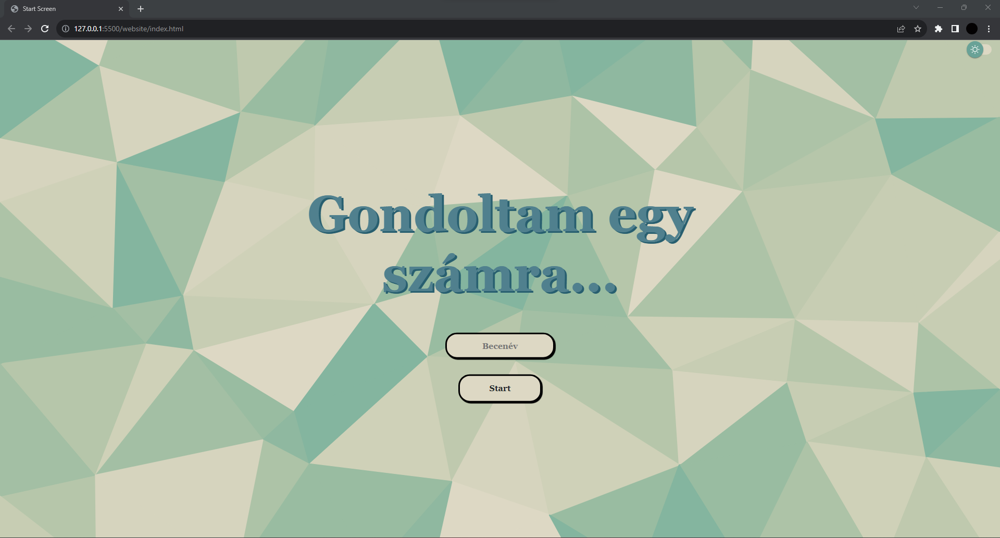
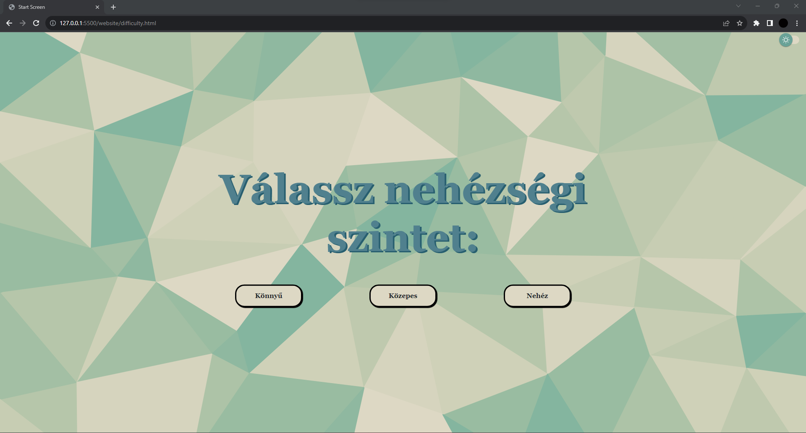
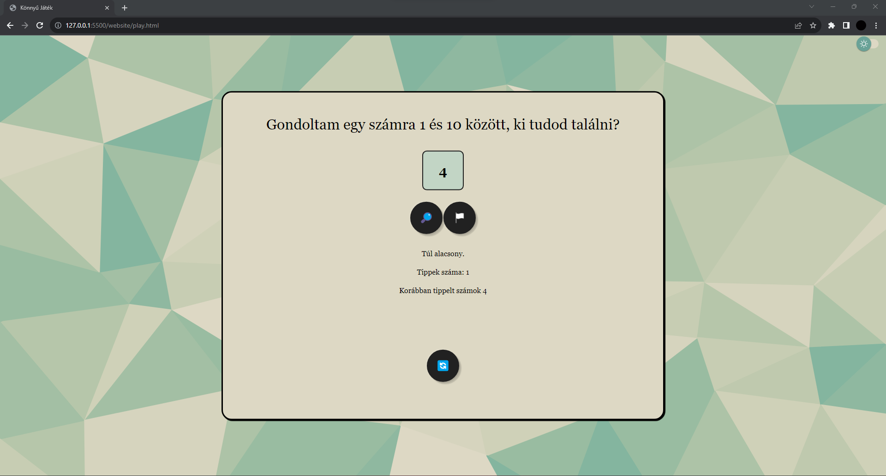
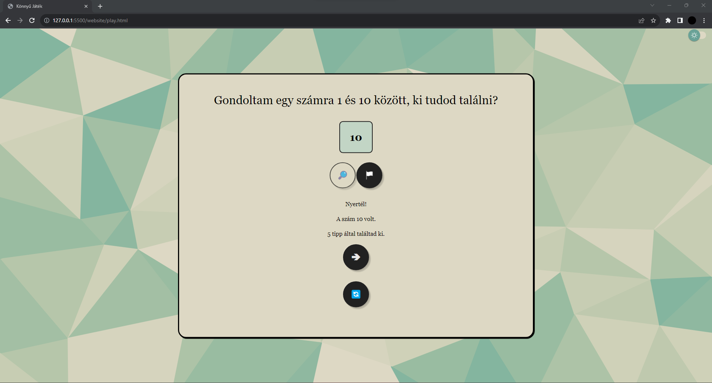
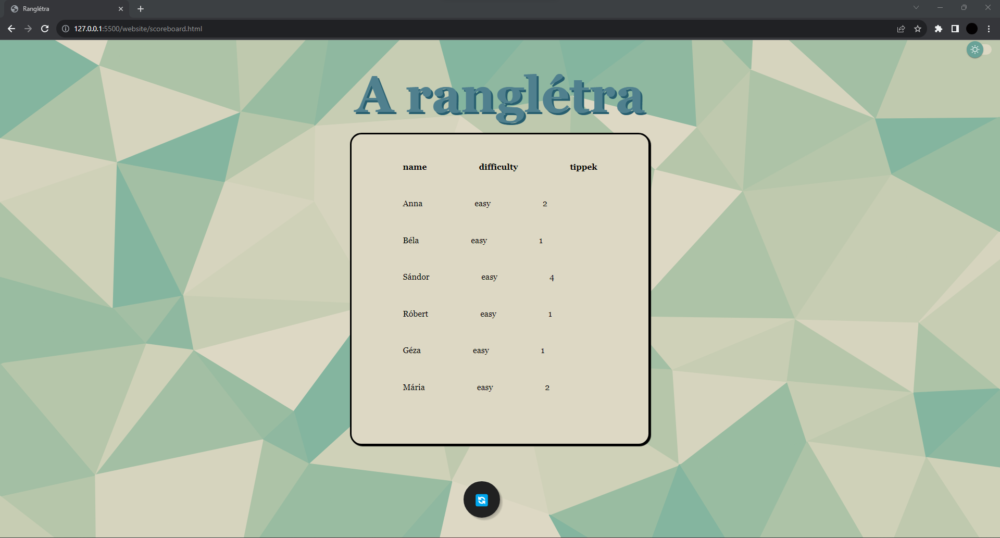
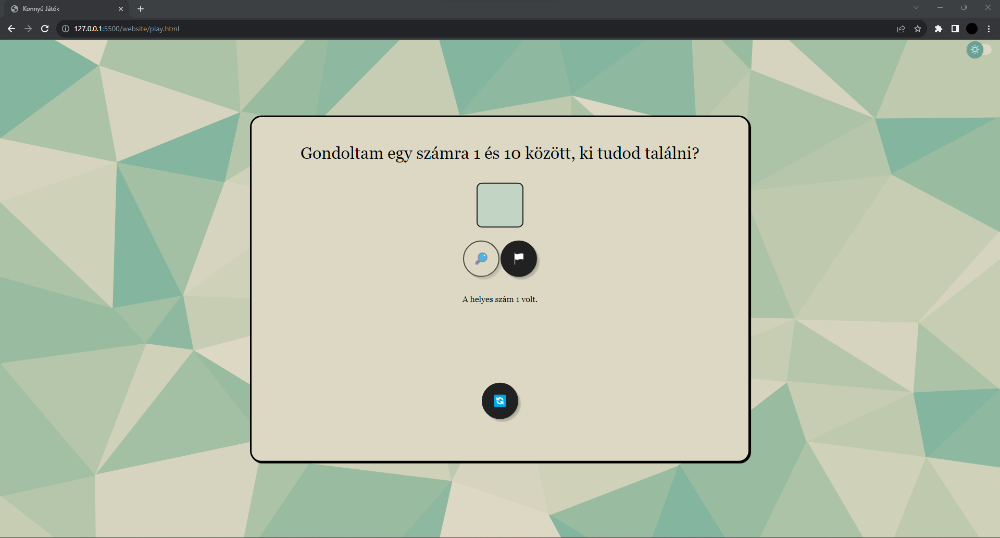
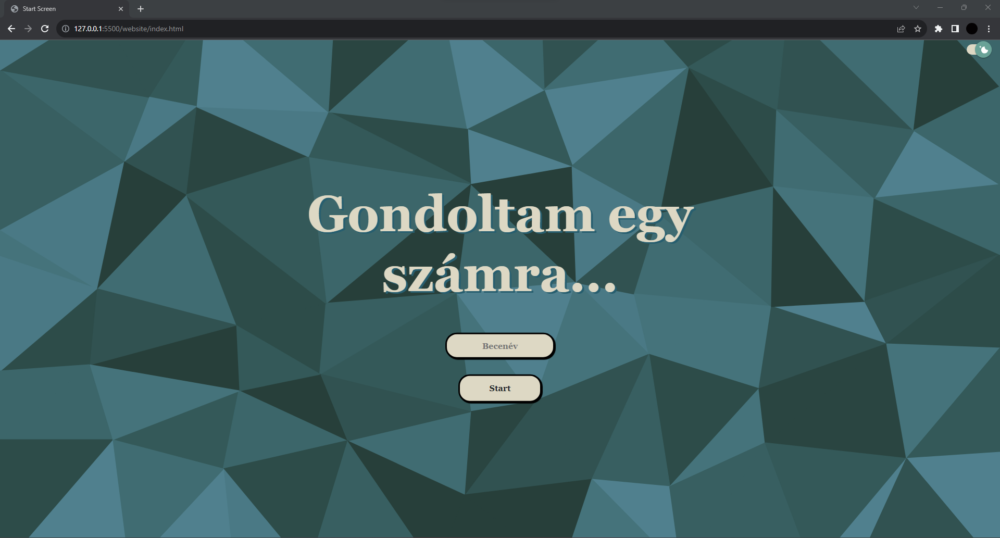

# Teszt
Ez a dokumentum a teszttervben felsorolt tesztek eredményeinek összegyűjtésére szolgál. A tesztelés folyamán szerzett információkat ebbe a dokumentumba fogjuk beilleszteni.

## 1. Működőképesség tesztelése
Elsősorban a megírt funkciók helyes működéséről győződünk meg. Ehhez a fejlesztők különböző erőforrású számítógépeken futtatják a programot, és jegyzetet készítenek az esetleges előforduló hibákról. 
Ha minden számítógépen gond nélkül fut, továbbhaladhatunk a fejlesztéssel. Amennyiben egy is hibát dob, a helyzetet kielemezzük, megkeressük a befolyásoló tényezőt és kijavítjuk azt, majd csak ezután haladunk tovább.

A tesztet legalább 2 különböző számítógépen végezzük el, de minél több esetet szeretnénk ellenőrizni. Akkor nevezhető a teszt sikeresnek, ha a tesztelésre használt eszközök legalább fele 2 évnél idősebb. Erre azért van szükség, mert komolyan vesszük a felhasználó-orientáltságot, és nem realisztikus az a feltevés, hogy terhelésnek alig kitett, új gépeken fogják használni a programunkat. Célunk az esélyegyenlőség, azaz, hogy bárki szabadon használni tudja a játékot.

Ennek érdekében több féle eszközön fogjuk a tesztelést futtatni. Az elsődleges eszközök:
| Processzor | RAM  | Életkor | Állapot  |
|------------|------|---------|----------|
| AMD Ryzen 7   | 16GB | 2 év    | Kiváló    |
| AMD Ryzen 5  | 8GB  | 3 év    | Elégséges  |

Egyéb tesztelésre használt eszközök:
| Processzor | RAM  | Életkor | Állapot  |
|------------|------|---------|----------|
| AMD Ryzen 5   | 8GB | 1 év    | Kiváló    |
|  Intel Core i5  | 8GB  | 6 év    | Kielégítő  |
|  AMD Ryzen 5  | 31GB  | <1 év    | Kiváló  |

### Eredmények
| Processzor | RAM  | Életkor | Állapot  |  Előfordult hiba  |
|------------|------|---------|----------|----|
| AMD Ryzen 7   | 16GB | 2 év    | Kiváló    |  Nem  |
| AMD Ryzen 5  | 8GB  | 3 év    | Elégséges  | Nem   |

Egyéb tesztelésre használt eszközök:
| Processzor | RAM  | Életkor | Állapot  |  Előfordult hiba  |
|------------|------|---------|----------|-----|
| AMD Ryzen 5   | 8GB | 1 év    | Kiváló    |    |
|  Intel Core i5  | 8GB  | 6 év    | Kielégítő  |  Nem  |
|  AMD Ryzen 5  | 31GB  | <1 év    | Kiváló  |  Nem  |

### Konklúzió

## 2. Felület tesztelése
Itt a fő szempont, hogy a felületen minden szükséges elem megtalálható, mindhez hozzá van kötve a megfelelő funkció. A kód tisztítása is itt történik, a funkcióval nem rendelkező elemek eltávolításra kerülnek.
A követelménylistánk a következő:

| Modul       | ID  | Név               | V   | Kifejtés                                       |
|-------------|-----|-------------------|-----|------------------------------------------------|
| Jogosultság | L1  | Névadás           | 1.0 | A felhasználó nevének megadása                |
| Modifikáció | M1  | Nehézség választás| 1.0 | A játék nehézségének kiválasztása             |
| Modifikáció | M2  | Név-rangsorba     | 1.0 | Név leadása a ranglistára                     |
| Feladat     | F1  | Start             | 1.0 | Start gomb ami átad a játékfelületre          |
| Feladat     | F2  | Tipp              | 1.0 | Mező ahova a tippet írjuk                     |
| Feladat     | F3  | Check             | 1.0 | Gomb ami a tippet leellenőrzi és kiírja hogy kisebb vagy nagyobb, vagy eltaláltuk és átrak a rangsor kijelzőre |
| Feladat     | F4  | Feladás           | 1.0 | Feladás gomb amivel feladhatjuk              |
| Jogosultság | L2  | Rangsor           | 1.0 | Rangsor kijelző                               |
| Jogosultság | L3  | Új játék          | 1.0 | Új játék indítása                              |

Az ehhez szükséges elemek:
| Név               | V   | Szükséges elem                                       |
|-------------------|-----|------------------------------------------------|
| Névadás           | 1.0 | Mező, amely billentyűzetről vár tartalmat                |
| Nehézség választás| 1.0 | 3 db gomb            |
| Név-rangsorba     | 1.0 | ranglistát kezelő függvények                     |
| Start             | 1.0 | Gomb          |
| Tipp              | 1.0 | Mező, amely billentyűzetről vár tartalmat                     |
| Check             | 1.0 | Gomb |
| Feladás           | 1.0 | Gomb              |
| Rangsor           | 1.0 | Kijelző, és ehhez tartozó adatbázis                               |
| Új játék          | 1.0 | Gomb                              | 

Egyéb elemek:
| Név               | V   | Szükséges elem                                       |
|-------------------|-----|------------------------------------------------|
| Témaváltó           | 1.0 | gomb                |

### Eredmények
| Processzor | RAM  | Életkor | Állapot  |  Előfordult hiba  |
|------------|------|---------|----------|----|
| AMD Ryzen 7   | 16GB | 2 év    | Kiváló    |  Nem  |
| AMD Ryzen 5  | 8GB  | 3 év    | Elégséges  |  Nem  |
| AMD Ryzen 5   | 8GB | 1 év    | Kiváló    |    |
|  Intel Core i5  | 8GB  | 6 év    | Kielégítő  |  Nem  |
|  AMD Ryzen 5  | 31GB  | <1 év    | Kiváló  |  Nem  |

### Konklúzió

## 3. Felület kinézetének tesztelése
Célunk, hogy fizikai/érzékszervi korlátokkal rendelkező felhasználóink számára is akadálymentesítsük a felületet. Ennek érdekében külön figyelmet fordítunk a felület kinézetének ellenőrzésére. A színek kontrasztossága, a feliratok olvashatósága a szempont, így különböző monitorokon szeretnénk látni a futó kódot. Ezen tesztelési résznél ellenőrizzük, hogy van-e olyan dizájn-elem, amely nem rendelkezik saját funkcióval, de a felhasználó irányítására szolgál, és valamiféle hibát eredményezhet. Például egy felirat helytelen animálása vezethet villódzáshoz.
- Gombok helyes megjelenítése
- Feliratok olvashatósága
- Színek kontrasztosságának ellenőrzése
- Felületek közötti váltások rugalmassága
- Felületek tartalmának letisztultsága
- Felhasználó irányítására szolgáló, szerepüket tökéletesen ellátó üzenetek/feliratok

Külön felület kinézeti tesztet kap a sötét és a világos téma, így igény szerint lehet köztük váltani, fizikai/érzékszervi korlátok nem befolyásolják, melyiket használja a felhasználó.
- Gombok helyes megjelenítése
- Feliratok olvashatósága
- Színek kontrasztosságának ellenőrzése
- Felületek közötti váltások rugalmassága
- Felületek tartalmának letisztultsága
- Felhasználó irányítására szolgáló, szerepüket tökéletesen ellátó üzenetek/feliratok

### Eredmények

#### Képernyőképek a működésről

### Konklúzió

## 4. Teljesítményteszt
Gyorsan működő program az elvárásunk, ezért fontos, hogy ellenőrizzük a sebességet. A tesztelés során A működőképesség tesztelésénél sorolt eszközökön megmérjük, mennyi időt vesz igénybe az első futás.

### Eredmények

| Processzor | RAM  | Életkor | Állapot  |  Sebesség  |
|------------|------|---------|----------|----|
| AMD Ryzen 7   | 16GB | 2 év    | Kiváló    |  < 1 ms  |
| AMD Ryzen 5  | 8GB  | 3 év    | Elégséges  |  < 1 ms  |
| AMD Ryzen 5   | 8GB | 1 év    | Kiváló    |    |
|  Intel Core i5  | 8GB  | 6 év    | Kielégítő  |  < 1 ms  |
|  AMD Ryzen 5  | 31GB  | <1 év    | Kiváló  |  < 1 ms  |

### Konklúzió

## 5. Biztonsági teszt
Egy nagyszabású program esetében fontos, hogy alapos biztonsági teszteken essen át. Ellenőrizendő, hogy a felhasználók adatai megfelelően védettek-e. Esetünkben a felhasználó nem tud olyan adatot megadni, amely önmagában elég lenne ahhoz, hogy bárminem visszaélés áldozata legyen. Ebből kifolyólag nem érdemes nagy figyelmet fordítanunk a biztonsági tesztre. Nem kerül érzékeny adat a rendszerbe, a felhasználó aggodalom nélkül élvezheti a játékot.

## 6. Kompatibilitási teszt
A programot több böngészőben is tesztelni fogjuk, mindegyik eszközön.
| Processzor | RAM  | Életkor | Állapot  | Chrome | Firefox | Edge   |
|------------|------|---------|----------|--------|---------|--------|
| AMD Ryzen 5   | 8GB | 1 év    | Kiváló    | x  |  x  |    |
|  Intel Core i5  | 8GB  | 6 év    | Kielégítő  | x  |    |  x  |
|  AMD Ryzen 5  | 31GB  | <1 év    | Kiváló  | x  |    |    |
| AMD Ryzen 7   | 16GB | 2 év    | Kiváló    |   |  x  |  x  |
| AMD Ryzen 5  | 8GB  | 3 év    | Elégséges  | x  |    |  x  |

### Eredmények
A tesztek hibára futottak a következő böngészőkben:
| Processzor | RAM  | Életkor | Állapot  | Chrome | Firefox | Edge   |
|------------|------|---------|----------|--------|---------|--------|
| AMD Ryzen 5   | 8GB | 1 év    | Kiváló    |   |    |    |
|  Intel Core i5  | 8GB  | 6 év    | Kielégítő  | Nem   |    |  Nem  |
|  AMD Ryzen 5  | 31GB  | <1 év    | Kiváló  | Nem  |    |    |
| AMD Ryzen 7   | 16GB | 2 év    | Kiváló    |   |  Nem  |   Nem |
| AMD Ryzen 5  | 8GB  | 3 év    | Elégséges  | Nem  |    |  Nem  |

### Konklúzió

## 7. Dokumentáció ellenőrzés
A fejlesztés és tesztelés végén újból végigolvassuk a dokumentációt. Szükség esetén frissítjük és/vagy kiegészítjük. Meggyőződünk a dokumentációk naprakészségéről, jólformázottságáról és könnyű értelmezhetőségéről.

### Eredmények

### Konklúzió
